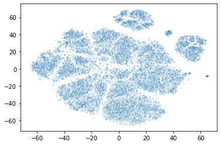

# Пример кластеризации данных большой размерности.

[Список всех проектов](https://github.com/Drev0Z/index)

Блокнот с кодом: [Jupyter Notebook](Clustering.ipynb)

Кластеризуются представления данных (эмбединги), полученные из Autoencoder'а.
Это позволяет избавиться от линейно-зависимых столбцов, снизить размерность данных и упростить процесс кластеризации.

Дальнейшее снижение размерности до 2х методом t-SNE позволяет визуализровать данные.

Кластеризация осуществляется алгоритмом DBSCAN, который не требует предварительного задания числа кластеров и умеет находить кластеры со сложной топологией.

[Список всех проектов](https://github.com/Drev0Z/index)

